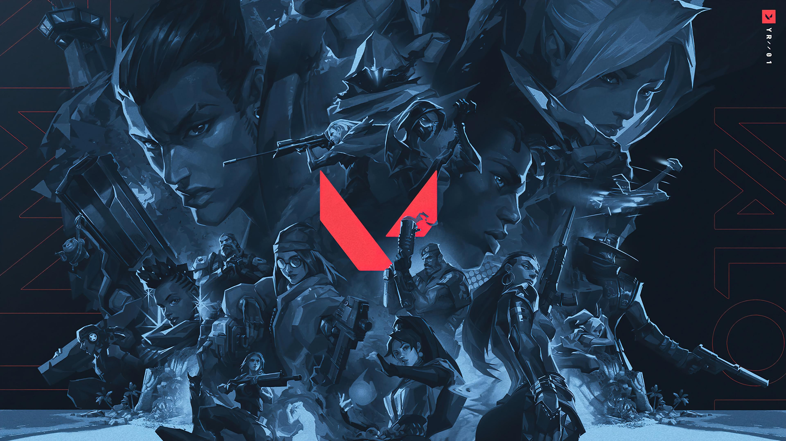

```{r setup, include=FALSE}

knitr::opts_chunk$set(echo=FALSE)

# Librairies
library(readr)
library(dplyr)
library(tidyr)
library(tidyverse)
library(ggplot2)
library(magrittr)
library(stringr)
library(purrr)
```

# Introduction

Dans le cadre de l'UE d'IF36, nous souhaitons utiliser des données nombreuses et variées sur un thème précis afin d'étudier des corrélations, des tendances et autres liens.
Pour ce faire, nous utiliserons différents outils pour créer des graphiques simples à comprendre et à lire.

```{r, fig.align="center", out.width="100%"}

```

Valorant sera le support de nos données.
Il s'agit d'un jeu de tir par équipe.
Il existe de nombreux personnages uniques, ainsi que des cartes et des armes variées.
On y trouve également également une scène compétitive très développée, avec des milliers de joueurs professionnels.
Ces innombrables données permettront de répondre à toutes les questions que nous avons sur le jeu et ses joueurs.

La description détaillée des datasets mobilisés est à retrouver dans le README.md de notre repo.

## ⚠️IMPORTANT: Comment lire les données

La plupart des données sont accessibles après un simple git clone ou git pull au format csv. Seule'archive .zip du dataset 3 nécessite d'être extraite, et renommer le dossier résultant avec exactement le même nom que l'archive (sans le .zip): "3. Valorant Champion Tour 2021-2026 Data" . Ainsi, le code devrait compiler knit devrait normalement marcher.

# 1. Quelles sont les différences majeures entre les joueurs pros et non pros ?

...

# 2. Quels personnages sont les plus meurtriers ?

En prenant en compte seulement les joueurs non pros pour plus de "réalisme", on veut voir si des agents vont avoir une quantité d'éliminations / de dégâts largement supérieure, et voir à l'inverse quels agents mettent le moins de dégâts et font le moins de kills.
On pourra éventuellement faire le lien ensuite avec les compétences de ces agents, pour voir si le résultat s'explique ou non.

Pour éviter les données de joueurs pros, nous allons utiliser le dataset ["Agents Stats" de blitz.gg](https://blitz.gg/valorant/stats/agents).
Pour exploiter les données du site, nous avons réussi à trouver [l'API interne](https://data.v2.iesdev.com/api/v1/query_objects/prod/val/agent_stats?tier=18%2B&queue=competitive&map=ALL&ep_act=ev26actiii) qui renvoie tout un tas de statistiques intéressantes qui ne sont d'ailleurs pas visibles sur la page.
Ces statistiques concernent tous les agents sur toutes les maps, pour les matchs en mode compétitif pour les rangs Diamant et +, lors de la dernière saison.

```{r, include=FALSE, echo=FALSE}
blitzagents <- read_csv("data/blitz_agents_stats.csv")
head(blitzagents)
```

On peut commencer par comparer simplement le nombre de kills pour chaque agent.
Seulement, il est possible que tous les agents ne soient pas choisis par les joueurs dans des proportions égales.
Si c'est le cas, alors c'est un paramètre qu'il faut prendre en compte.
Alors commençons par s'intéresser au nombre de kills en fonction du nombre de matchs joués.

```{r}
ggplot(blitzagents, aes(x = matchesPlayed, y = kills, color = agent)) +
  geom_point() +
  labs(
    x = "Nombre de matchs",
    y = "Nombre de kills",
    title = "Kills en fonction du nombre de matchs pour chaque agent"
  ) +
  theme_minimal()
```

Comme il est difficile de voir réellement les agents sur le graphique, voici les agents classés par nombre de matchs joués pour pouvoir faire le lien.

```{r}
ggplot(blitzagents, aes(x = reorder(agent, matchesPlayed), y = matchesPlayed)) +
  geom_col(fill = "#ff4654") +
  coord_flip() +
  labs(
    x = "Agent",
    y = "Nombre de matchs",
    title = "Matchs joués par agent"
  ) +
  theme_minimal() +
  theme(axis.text.y = element_text(face = "bold"))
```

On remarque tout de suite une forte corrélation entre nombre de kills et nombre de matchs: c'est quasiment une fonction linéaire.
Cela montre bien que les agents sont choisis de manière très inégale (et on retient que Jett est le personnage le plus joué de loin), et que l'on ne pourra pas tirer de conclusions intéressantes si on ne prend pas en compte le nombre de matchs pour chaque agent.
Il faut se débrouiller pour observer des moyennes ou des ratios de plusieurs façons.
Commençons par une statistique importante et connue: le Kills/Deaths ratio, qui nous permettra de voir quels agents meurent plus qu'ils ne tuent en moyenne.

```{r}
kdstat <- blitzagents %>%
  mutate(kd = kills / deaths)

ggplot(kdstat, aes(x = reorder(agent, kd), y = kd)) +
  geom_col(fill = "#ff4654") +
  coord_flip(ylim = c(0.85, 1.15)) +
  labs(
    x = "Agent",
    y = "K/D",
    title = "Kills/Deaths Ratio pour chaque agent"
  ) +
  theme_minimal() +
  theme(axis.text.y = element_text(face = "bold"))
```

On remarque que le personnage de Jett a un bon KD, mais ce n'est pas le plus haut non plus.
On remarque bien sûr le KD de Chamber, le plus haut et le seul supérieur à 1.1.

Avec la stat matchesPlayed, on peut essayer de s'intéresser au nombre de kills par match en moyenne pour chaque agent.
Cela peut nous permettre de mieux comprendre quels agents ont des styles de jeu plus agressifs.
Nous verrons par la même occasion si les tendances précédentes se confirment.

```{r}
statrounds <- blitzagents %>%
  mutate(killsPerRound = kills / matchesPlayed, deathsPerRound = deaths / matchesPlayed)

ggplot(statrounds, aes(x = reorder(agent, killsPerRound), y = killsPerRound)) +
  geom_col(fill = "#ff4654") +
  coord_flip(ylim = c(13, 18)) +
  labs(
    x = "Agent",
    y = "Kills/match",
    title = "Kills par match en moyenne de chaque agent"
  ) +
  theme_minimal() +
  theme(axis.text.y = element_text(face = "bold"))
```

On retrouve Jett en tête du classement.
On a aussi Phoenix, Reyna et Chamber qui avaient tous de bons KD, tandis que Clove est plutôt une surprise puisqu'iel avait un KD dans la moitié la plus basse.
Pourtant, Chamber ne se trouve même pas dans le top 5 alors qu'il avait le meilleur KD assez loin devant les autres.
Mais le haut KD de Chamber s'explique par son set de compétences, qui servent toutes à mettre des dégâts et teur des adversaires.

En somme, Jett a des très bonnes stats dans toutes les données que nous avons explorées.
On a remarqué aussi que c'est le personnage le plus populaire, et c'est probablement dû justement à son style de jeu agressif et qui génère des kills que nous avons pu le constater.
Les autres personnages avec de bons KD et kills comme Chamber, Phoenix et Reyna font aussi partie des personnages les plus choisis.
On peut donc se douter que ce qui fait leur popularité est précisément leur set de compétences qui leur permet d'être des personnages au coeur de l'action régulièrement.

# 3. Quels joueurs pros ont la carrière la plus prolifique ?

Dans cette partie, nous allons tenter de répondre à la question suivante : **Quels joueurs pros ont la carrière la plus prolifique ?** L'idée de cette question est d'observer les joueurs prometteurs pour voir où est ce qu'on les retrouvera dans d'autres analyses.

Dans l'idée, nous souhaitons réaliser un barchart permettant de voir les 10 meilleurs joueurs de chaque année, afin d'en observer l'évolution.

### Graphiques des mailleurs joueurs de chaque année

```{r, include=FALSE, echo=FALSE}
perfs_2021 <- read_csv("data/3. Valorant Champion Tour 2021-2026 Data/vct_2021/players_stats/players_stats.csv")
perfs_2022 <- read_csv("data/3. Valorant Champion Tour 2021-2026 Data/vct_2022/players_stats/players_stats.csv")
perfs_2023 <- read_csv("data/3. Valorant Champion Tour 2021-2026 Data/vct_2023/players_stats/players_stats.csv")
perfs_2024 <- read_csv("data/3. Valorant Champion Tour 2021-2026 Data/vct_2024/players_stats/players_stats.csv")
perfs_2025 <- read_csv("data/3. Valorant Champion Tour 2021-2026 Data/vct_2025/players_stats/players_stats.csv")
```

```{r}
# Graphique 2021
unique_players_2021 <- perfs_2021 %>% filter(!duplicated(Player)) #Suppression des doublons
top_players_2021 <- head(unique_players_2021 %>% arrange(desc(Rating)), 10) # Récupération des meilleurs joueurs
ggplot(top_players_2021, aes(x = reorder(Player, -Rating), y = Rating)) + geom_bar(stat = "identity") + labs(title = "Bar chart des meilleurs joueurs de 2021", x = "Joueur", y = "Rating") #Graphique

```

```{r}
# Graphique 2022
unique_players_2022 <- perfs_2022 %>% filter(!duplicated(Player)) #Suppression des doublons
top_players_2022 <- head(unique_players_2022 %>% arrange(desc(Rating)), 10) # Récupération des meilleurs joueurs
ggplot(top_players_2022, aes(x = reorder(Player, -Rating), y = Rating)) + geom_bar(stat = "identity") + labs(title = "Bar chart des meilleurs joueurs de 2022", x = "Joueur", y = "Rating") #Graphique

```

```{r}
# Graphique 2023
unique_players_2023 <- perfs_2023 %>% filter(!duplicated(Player)) #Suppression des doublons
top_players_2023 <- head(unique_players_2023 %>% arrange(desc(Rating)), 10) # Récupération des meilleurs joueurs
ggplot(top_players_2023, aes(x = reorder(Player, -Rating), y = Rating)) + geom_bar(stat = "identity") + labs(title = "Bar chart des meilleurs joueurs de 2023", x = "Joueur", y = "Rating")#Graphique
```

```{r}
# Graphique 2024
unique_players_2024 <- perfs_2024 %>% filter(!duplicated(Player)) #Suppression des doublons
top_players_2024 <- head(unique_players_2024 %>% arrange(desc(Rating)), 10) # Récupération des meilleurs joueurs
ggplot(top_players_2024, aes(x = reorder(Player, -Rating), y = Rating)) + geom_bar(stat = "identity") + labs(title = "Bar chart des meilleurs joueurs de 2024", x = "Joueur", y = "Rating") #Graphique

```

```{r}
# Graphique 2025
unique_players_2025 <- perfs_2025 %>% filter(!duplicated(Player)) #Suppression des doublons
top_players_2025 <- head(unique_players_2025 %>% arrange(desc(Rating)), 10) # Récupération des meilleurs joueurs
ggplot(top_players_2025, aes(x = reorder(Player, -Rating), y = Rating)) + geom_bar(stat = "identity") +
labs(title = "Bar chart des meilleurs joueurs de 2025", x = "Joueur", y = "Rating") #Graphique
```

## Line Chart de l'évolution des meilleurs joueurs

Voyant que les 10 meilleurs joueurs changent régulièrement, nous avons souhaité vérifier si les meilleurs joueurs restent dans le top 10 plusieurs années d'affilée

```{r, include=FALSE, echo=FALSE, error=FALSE, warning=FALSE, message=FALSE}
top_players <- bind_rows(
  top_players_2021 %>% mutate(annee = 2021),
  top_players_2022 %>% mutate(annee = 2022),
  top_players_2023 %>% mutate(annee = 2023),
  top_players_2024 %>% mutate(annee = 2024),
  top_players_2025 %>% mutate(annee = 2025)
)
```

```{r, echo=FALSE, error=FALSE, warning=FALSE, message=FALSE}
ggplot(top_players, aes(x = annee, y = Rating, group = Player)) + geom_line(aes(color=Player)) + geom_point(aes(color=Player)) +
labs(title = "Bar chart des meilleurs joueurs de 2025", x = "Joueur", y = "Rating", colour = "Player") #Graphique
```

## Interprétation

Le choix de représentation nous amène à observer que les premiers joueurs changent chaque année et que donc il est très difficile d'observer la progression de seulement les meilleurs joueurs.
Le dernier graphique montre d'ailleurs que chaque joueur n'apparait jamais plusieurs fois dans le top 10.
Il est donc impossible d'en percevoir l'évolution.

# 4. Qui sont les joueurs les plus forts en clutch ?

Être capable de retourner une situation désespérée est un atout considérable pour un joueur professionnel de Valorant.
Le clutch est le fait de remporter une manche en étant le dernier membre de son équipe, tout en devant se battre contre plusieurs adversaires.
Nous allons voir quels joueurs se retrouvent le plus souvent en situation de clutch (seul contre tous), et lesquels s'en sortent le mieux.
Nous utiliserons la [source n°3](https://www.kaggle.com/datasets/ryanluong1/valorant-champion-tour-2021-2023-data)

```{r préparation des données, include=FALSE, echo=FALSE, message=FALSE}
# Récupérer les données
df2021 <- read_csv("data/3. Valorant Champion Tour 2021-2026 Data/vct_2021/players_stats/players_stats.csv")
df2022 <- read_csv("data/3. Valorant Champion Tour 2021-2026 Data/vct_2022/players_stats/players_stats.csv")
df2023 <- read_csv("data/3. Valorant Champion Tour 2021-2026 Data/vct_2023/players_stats/players_stats.csv")
df2024 <- read_csv("data/3. Valorant Champion Tour 2021-2026 Data/vct_2024/players_stats/players_stats.csv")
df2025 <- read_csv("data/3. Valorant Champion Tour 2021-2026 Data/vct_2025/players_stats/players_stats.csv")
df2026 <- read_csv("data/3. Valorant Champion Tour 2021-2026 Data/vct_2026/players_stats/players_stats.csv")

# Unification des données
df <- bind_rows(
  df2021 %>% mutate(annee = 2021),
  df2022 %>% mutate(annee = 2022),
  df2023 %>% mutate(annee = 2023),
  df2024 %>% mutate(annee = 2024),
  df2025 %>% mutate(annee = 2025),
  df2026 %>% mutate(annee = 2026),
)

# Nettoyage des données
df <- df %>% mutate(`Clutch Success %` = as.numeric(str_remove(`Clutch Success %`, "%")))
df <- df %>% separate(`Clutches (won/played)`, into = c("Clutches won","Clutches played"), sep = "/", convert = TRUE)
df <- df %>% group_by(Player, annee) %>% summarize(`Clutches won` = sum(`Clutches won`, na.rme = TRUE), `Clutches played` = sum(`Clutches played`, na.rme = TRUE)) %>% mutate(`Clutch Success %` = `Clutches won` / `Clutches played`)
df <- df %>% arrange(desc(`Clutch Success %`))
df <- df %>% mutate(`Clutches lost` = `Clutches played` - `Clutches won`)
```

```{r visu1, echo=FALSE}
top5 <- df %>%
  group_by(annee, Player) %>%
  summarise(
    `Clutches played` = sum(`Clutches played`, na.rm = TRUE),
    `Clutches won` = sum(`Clutches won`, na.rm = TRUE),
    .groups = "drop"
  ) %>%
  group_by(annee) %>%
  slice_max(`Clutches played`, n = 5, with_ties = FALSE) %>%
  ungroup()

plot_year <- function(y) {
  df <- top5 %>% filter(annee == y)
  ggplot(df, aes(x = reorder(Player, -`Clutches played`))) +
    geom_col(aes(y = `Clutches played`, fill = "Clutches perdus"), fill = rgb(0.17, 0.21, 0.35)) +
    geom_col(aes(y = `Clutches won`, fill = "Clutches gagnés"), fill = "#ff4654")+
    labs(
      title = paste("Top 5 joueurs qui clutchent le plus en", y),
      x = "Joueur",
      y = "Nombre de clutchs"
    ) +
    theme_minimal()
}

plot_year(2021)
plot_year(2022)
plot_year(2023)
plot_year(2024)
plot_year(2025)
plot_year(2026)
```

## Interprétation

On a beaucoup d'informations intéressantes sur ces graphes.
Déjà, on voit que d'une année à l'autre, les joueurs ne sont pas les mêmes.
On voit donc qu'il n'existe pas de joueur spécialement meilleur que les autres dans ces situations.
On voit également que la quantité de clutchs varie grandement d'une année à l'autre.
Ce n'est pas parce que ces situations sont plus ou moins rares, mais parce que dans certaines années, il y a eu moins de matchs.
En 2021, car le jeu venait de sortir, et donc la scène compétitive comptait moins de joueurs, et en 2025 et 2026 car le dataset ne répertorie pas tous les matchs de ces années.
On remarque cependant un point commun chez tous les joueurs présents dans ce tableau : ils jouent principalement des contrôleurs ou sentinelles, c'est à dire des agents servant de soutien aux duellistes.
On peut expliquer cela car ces personnages sont souvent placés en retrait, et survivent généralement plus longtemps que ceux qui cherchent à se battre.

# 5. Quelles cartes sont orientées attaque ou défense ?

Les cartes ne sont pas toujours équilibrées pour les attaquants ou les défenseurs.
Si l'une d'entre elles favorise les défenseurs, on pourra expliquer en partie leurs victoires répétées.

On étudiera d'abord pour les joueurs normaux, puis on verra si les pros sont aussi sujets à ces déséquilibres.
Pour cela, on va étudier les winrates propres à chaque map en fonction des deux camps possibles (Attacker ou Defender).

## Pour tous les joueurs

Commençons par étudier les données concernant les joueurs lambda grâce à [cette ressource](https://blitz.gg/valorant/stats/maps?act=ev25actvi) qui nous donne les taux de victoire pour les côtés attaquant et défenseur sur chaque map pour toute une saison de 2025.

```{r donnees, include=FALSE}
donnees = tibble(
  Map = c("Abyss","Corrode","Pearl","Haven","Sunset","Split","Bind"),
  attacking_rounds_won = c(50.6, 49.5, 48.8, 48.8, 48.1, 47.5, 46.7),
  defending_rounds_won = c(49.7, 50.8, 51.5, 51.4, 52.2, 52.7, 53.5)
)
donnees <- donnees %>%
  rename(Attacker = attacking_rounds_won,
         Defender = defending_rounds_won) %>%
  pivot_longer(
    cols = c(Attacker, Defender),
    names_to = "Side",
    values_to = "WinRate"
  )

```

Faisons une visualisation:

```{r}
ggplot(donnees, aes(x = Map, y = WinRate, fill = Side)) +
  geom_col(width = 0.75, position = "dodge") +
  scale_fill_manual(values = c("#ff4654", rgb(0.17, 0.21, 0.35))) +
  scale_y_continuous(breaks = seq(0, 100, by = 5)) +
  theme(axis.text.x = element_text(angle = 30, hjust = 1, vjust = .5, face = "bold"))
```

Finalement, les maps disponibles semblent assez équilibrées car toutes les valeurs sont entre 45 et 55%, même si on peut tout de même constater quelques écarts.
On remarque que la map Bind a le plus gros écart, avec un winrate en défense proche de 46%.
A l'inverse, la map Abyss semble la plus équilibrée ici, suivie de près par Corrode.
Elles semblent avoir tous leurs winrates entre 49 et 51%.

## Pour les joueurs professionnels

Voyons maintenant si les joueurs professsionnels ont des résultats similaires, ou s'ils ont peut-être plus d'écarts.

Ici on utilise un tableau relatif aux stats des maps de l'année 2025 des compétitions ESports.

```{r data, echo=FALSE, include=FALSE}
data = read_csv("data/3. Valorant Champion Tour 2021-2026 Data/vct_2025/agents/maps_stats.csv")

data <- data %>%
  select("Map","Attacker Side Win Percentage","Defender Side Win Percentage") %>%
  filter(Map != "All Maps")

data <- data %>%
  mutate(`Attacker Side Win Percentage` =
           as.numeric(gsub("%", "", `Attacker Side Win Percentage`)),
         `Defender Side Win Percentage` =
           as.numeric(gsub("%", "", `Defender Side Win Percentage`))) %>%
  group_by(Map) %>%
  summarise(
    Attacker = mean(`Attacker Side Win Percentage`, na.rm = TRUE),
    Defender = mean(`Defender Side Win Percentage`, na.rm = TRUE),
  )

data <- data %>%
  pivot_longer(
    cols = c(Attacker, Defender),
    names_to = "Side",
    values_to = "WinRate"
  )
```

Faisons une visualisation similaire à la première:

```{r}
ggplot(data, aes(x = Map, y = WinRate, fill = Side)) +
  geom_col(width = 0.75, position = "dodge") +
  scale_fill_manual(values = c("#ff4654", rgb(0.17, 0.21, 0.35))) +
  scale_y_continuous(breaks = seq(0, 100, by = 5)) +
  theme(axis.text.x = element_text(angle = 30, hjust = 1, vjust = .5, face = "bold"))
```

## Interprétation

On remarque qu'il y a plus de maps chez les pros que pour les joueurs publics.
C'est sans doute car les maps tournent régulièrement en public comme en tournoi, donc on ne peut pas faire une comparaison pour chaque map ici.
Mais c'est tout de même intéressant de toutes les garder pour constater si les écarts persistent ou sont plus impportants en règle générale.

Etonnamment, la map Abyss qui semblait être la plus équilibrée pour les joueurs lambda, s'avère être bien plus largement déséquilibrée chez les pros, avec des winrates au dehors de la fourchette 45-55%.
Globalement, il semble y avoir beaucoup plus de déséquilibres sur la scène sportive que dans le jeu en général.
C'est un résultat surprenant, mais on peut imaginer que c'est parce que les joueurs professionnels ont des connaissances bien plus avancées et des tactiques très précises selon la map sur laquelle ils jouent qui leur permettent de tirer profit d'une position ou d'une autre au maximum.
Par ailleurs, les stats concernant toutes les parties comprennent plusieurs millions de parties de joueurs de niveaux très différents, tandis que les données sur les joueurs pro concernent infiniment moins de parties jouées et de participants.
Les résultats sont donc peut-être biaisés.

# 6. Qu'est-ce qui compte le plus pour gagner une partie ?

On sait déjà que tuer tous les adversaires permet de gagner une manche, mais on veut étudier si les autres facteurs comme un choix d'agents optimal, ue stratégie précise, ou une bonne gestion de l'économie permet de faire pencher la balance.
Il faut faire attention avec ces données car certaines peuvent découler directement des autres.
Par exemple, gagner une manche permet d'avoir plus de crédits à dépenser pour gagner le suivant.
On pourra voir si ces critères changent entre les joueurs normaux et les pros.

# 7. Quelles sont les meilleures équipes ?

Quelles sont les équipes professionnelles ayant résisté au temps ?
Celles qui émergent ?
Celles qui forment les meilleurs talents ?
Notre réponse sera évidemment subjective, mais on pourra l'argumenter de nombreuses façons.

# 8. Quelles sont les meilleures équipes par année ?

Complémentaire à la question précédente, on pourra ainsi voir l'évolution des équipes, et la corréler aux changements de joueurs ou de coachs, ou bien d'ajouts de cartes ou d'agents, pour voir les causes de ces évolutions.

## Import des données

On importe les données des Valorant Champion 2021-2025 en récupérant:

- Le winrate par équipe

- Le nombre de changements au roster entre 2022 et 2025

```{r, include=FALSE}
resultat_final <- map_df(2021:2025, \(an) {
  read.csv(sprintf("data/3. Valorant Champion Tour 2021-2026 Data/vct_%d/matches/overview.csv", an)) %>%
    filter(Tournament == paste("Valorant Champions", an)) %>%
    distinct(Annee = an, Equipe = Team, Player)
})

roster_data <- resultat_final

resultat_final <- roster_data %>%
  group_by(Equipe) %>%
  arrange(Annee) %>%
  mutate(Changements = map_int(Annee, \(a) {
    if (a == 2021) return(0)
    curr <- roster_data$Player[roster_data$Annee == a & roster_data$Equipe == first(Equipe)]
    prev <- roster_data$Player[roster_data$Annee == a - 1 & roster_data$Equipe == first(Equipe)]
    if (length(prev) == 0) return(0)
    length(setdiff(prev, curr))
  })) %>%
  distinct(Annee, Equipe, Changements) %>%
  ungroup()

tableau_final <- map_df(2021:2025, \(an) {
  path <- sprintf("data/3. Valorant Champion Tour 2021-2026 Data/vct_%d/matches/scores.csv", an)
  read.csv(path) %>%
    filter(Tournament == paste("Valorant Champions", an)) %>%
    reframe(Team = c(Team.A, Team.B), S_Self = c(Team.A.Score, Team.B.Score), S_Opp = c(Team.B.Score, Team.A.Score)) %>%
    group_by(Team) %>%
    summarise(WinRate = mean(S_Self > S_Opp), Année = an, .groups = "drop")
})

data_combinee <- tableau_final %>%
  rename(Equipe = Team) %>%
  left_join(resultat_final, by = c("Année" = "Annee", "Equipe")) %>%
  mutate(Changements = replace_na(Changements, 0)) %>%
  filter(Equipe %in% names(which(table(Equipe) >= 3)))

```

```{r}
ggplot(data_combinee, aes(x = Année, group = Equipe)) +
  geom_area(aes(y = Changements / 11), fill = "orchid4", alpha = 0.2) + 
  geom_line(aes(y = Changements / 11), color = "orchid3", alpha = 0.8) +
  geom_line(aes(y = WinRate, color = Equipe), linewidth = 1) +
  geom_point(aes(y = WinRate, color = Equipe), size = 2.5) +
  facet_wrap(~ Equipe) +
  scale_y_continuous(
    name = "Win Rate (%)",
    limits = 0:1, labels = scales::percent,
    sec.axis = sec_axis(~ . * 11, name = "Nombre de changements de joueurs")
  ) +
  scale_x_continuous(breaks = 2021:2025) +
  theme_minimal() +
  theme(legend.position = "none", 
        axis.title.y.right = element_text(color = "orchid4", size = 9),
        panel.grid.minor = element_blank()) +
  labs(title = "Évolution du winrate aux Valorant Champion (2021-2025, 3 participation min.)")
```

## Interprétation

On a filtré les équipes pour n’afficher que les équipes avec le plus de longévité aux Valorant Champions (plus de 3 participations sur 2021-2025).
On a choisi de représenter le Winrate (Matchs gagnés/Matchs joués) pour afficher directement la performance.

Ce que l’on remarque, c’est que certaines équipes arrivent à se qualifier fréquemment, alors que la majorité des équipes qualifiées a 1-2 occurrences mais cela ne les empêche pas de remporter les Valorant Champion tout de même.
Concernant les équipes qui se qualifient régulièrement, DRX, FNATIC et Paper Rex semblent se distinguer par des performances qualitatives assez stables à travers les années

Le nombre de changement de joueurs semble indiquer que les changements de joueurs ont pour conséquence de faire baisser les performances de l'équipe, tandis qu'un taux de changement bas est souvent corrélé avec des performances stables sur le long terme.

# 9. Quel est le lien entre nombre de kills et victoire ?

On veut voir si il y a un lien entre le nombre de kills et gagner la manche, ou si la victoire est plutôt liée à la coordination autour de l'objectif.
On peut étudier la différence entre des joueurs normaux et pros.

```{r, include=FALSE, echo=FALSE, error=FALSE, warning=FALSE}
base_path <- "./data/3. Valorant Champion Tour 2021-2026 Data"
years     <- 2021:2026
folders   <- file.path(base_path, paste0("vct_", years))

process_round_file <- function(folder_path) {
  outcome_path <- file.path(folder_path, "matches", "win_loss_methods_round_number.csv")
  kills_path   <- file.path(folder_path, "matches", "rounds_kills.csv") 
  
  if (file.exists(outcome_path) && file.exists(kills_path)) {
    df_outcome <- read_csv(outcome_path, show_col_types = FALSE)
    df_kills   <- read_csv(kills_path, show_col_types = FALSE)

    team_kills <- df_kills %>%
      group_by(`Tournament`, `Match Name`, Map, `Round Number`, `Eliminator Team`) %>%
      summarise(Total_Kills = n_distinct(Eliminated), .groups = "drop") %>%
      rename(Team = `Eliminator Team`)
    
    merged_data <- df_outcome %>%
      left_join(team_kills, by = c("Tournament", "Match Name", "Map", "Round Number", "Team")) %>%
      mutate(Total_Kills = coalesce(Total_Kills, 0L))
    
    return(merged_data)
    
  } else if (file.exists(outcome_path)) {
    df_outcome <- read_csv(outcome_path, show_col_types = FALSE)
    return(df_outcome %>% mutate(Total_Kills = NA_integer_))
  }
  return(NULL)
}

round_outcome <- map_df(folders, process_round_file)

final_display <- round_outcome %>%
  select(Tournament, `Match Name`, Map, `Round Number`, Team, Total_Kills, Outcome) %>%
  arrange(`Match Name`, Map, `Round Number`, desc(Outcome))

```

```{r, echo=FALSE, error=FALSE, warning=FALSE}
pct_data <- final_display %>%
  group_by(Outcome, Total_Kills) %>%
  summarise(Count = n(), .groups = "drop_last") %>%
  mutate(Pct = (Count / sum(Count)) * 100) %>%
  ungroup()

ggplot(pct_data, aes(x = Total_Kills, y = Pct, color = Outcome, group = Outcome)) +
  geom_line(size = 1.2) +
  geom_point(size = 3) +
  
  scale_color_manual(values = c("Win" = "#4D96FF", "Loss" = "#FF6B6B")) +
  
  scale_x_continuous(limits = c(0, 5), breaks = 0:5) +
  scale_y_continuous(limits = c(0, 100), breaks = seq(0, 100, 20)) +
  
  coord_fixed(ratio = 1/20) +
  
  labs(
    title = "Répartition de la victoire/défaite en fonction\n
    du nombre d'élimination par rounds",
    x = "Nombre d'éliminations par round",
    y = "% de rounds",
    color = "Résultat"
  ) +
  theme_bw() +
  theme(
    plot.title = element_text(face = "bold", size = 14),
    panel.grid.major = element_line(color = "#e0e0e0"),
    panel.grid.minor = element_blank()
  )

```

Comme on peut le voir dans ce grpahique, le nombre d'éliminations et la victoire sont corrélés de façon particulière.
Dans le cas d'un coach d'équipe E-Sport, il peut être capital de savoir comment ceux-ci sont liés.
On voit qu'à 1 kill, le nombre de parties est quasiment 0, car les manches où le nombre d'éliminations est de 1 est extrêmement rare, les joueurs répliquent lorsqu'un de leur allié est éliminé.
On voit aussi que 2 éliminations ne sont souvent pas suffisantes, mais que quand la majorité de l'équipe adverse est éliminée, c'est très souvent le signe d'une victoire.
Dans le cas contraire, ne pas faire d'élimination montre que dans l'écrasante majorité des cas, on a subit une défaite.

# 10. Comment la visée ou le KDA influe sur le rang ?

Sans compter les joueurs pros, qui ont une visée nettement supérieure à celle des joueurs normaux, on verra si augmenter son KD (ratio d'éliminations sur morts) et sa visée influe sur le rang.

Pour cela, nous pouvons utiliser le dataset Stats and Ranks of 2600 Valorant Players, qui comprend les stats pertinentes pour cette question et concerne des joueurs amateurs.

On peut commencer par visualiser le KD moyen pour chaque rang.

```{r, echo=FALSE, error=FALSE, warning=FALSE, message=FALSE}
players <- read_csv("data/4-Stats and Ranks of 2600 Valorant Players.csv")

players$tier <- factor(
  players$tier,
  levels = c(
    "iron",
    "bronze",
    "silver",
    "gold",
    "platinum",
    "diamond",
    "ascendant",
    "immortal"
  )
)

kd_moyen <- players %>%
  mutate(kd = kills / deaths) %>%
  group_by(tier) %>%
  summarise(kd_moyen = mean(kd, na.rm = TRUE))

ggplot(kd_moyen, aes(x = tier, y = kd_moyen)) +
  geom_col(fill = "#ff4654") +
  coord_cartesian(ylim = c(0.8, 1.1)) +
  labs(
    x = "",
    y = "KD",
    title = "KD moyen en fonction de chaque rang"
  ) +
  theme_minimal() +
  theme(axis.text.x = element_text(face = "bold"))
```

Les rangs sont ici disposés dans l'ordre de progression du jeu.
On remarque clairement une corrélation entre la hauteur du KD et le rang.
Le KD augmente avec le rang.
Donc en moyenne, les joueurs avec les meilleurs KD sont aussi les joueurs les plus haut placés en compétitif.

Maintenant, nous pouvons refaire cette même observation mais avec une mesure de la visée.
Il est très difficile en général de mesurer la qualité de la visée des joueurs.
Ici, les données que l'on peut utiliser pour mesurer la qualité très globale de la visée sont le nombre de headshots et le nombre de kills.
En faisant un ratio headshots / kills, on peut avoir une idée globale de à quel point un joueur vise bien.
Utilisons donc ce ratio et faisons un graphique similaire avec celui-ci.

```{r, echo=FALSE}
hsk_moyen <- players %>%
  mutate(hsk = headshots / kills) %>%
  group_by(tier) %>%
  summarise(hsk_moyen = mean(hsk, na.rm = TRUE))

ggplot(hsk_moyen, aes(x = tier, y = hsk_moyen)) +
  geom_col(fill = "#ff4654") +
  coord_cartesian(ylim = c(0.4, 0.8)) +
  labs(
    x = "",
    y = "Headshots / kills",
    title = "Ratio headshots/kills moyen en fonction de chaque rang"
  ) +
  theme_minimal() +
  theme(axis.text.x = element_text(face = "bold"))
```

On remarque à nouveau une évolution frappante du ratio en fonction du rang.

Nous pouvons conclure que nos intuitions premières étaient justes: en général, les profils de joueurs ayant des KD élevés et une bonne visée sont systématiquement des joueurs de haut rang; et à l'inverse, ceux avec les KD et les visées moins bonnes se trouvent dans les premiers rangs.

# 11. Impact des parties précédentes sur l'actuelle

Pouvoir étudier l'influence du résultat des parties précédentes sur le winrate de la partie n.
L'intérêt serait pouvoir de créer un tableau 2x4 surles parties n-1 et n-2 (Depuis Victoire, Victoire / Victoire, Défaite, etc.. vers Victoire/Défaite)

```{r}
set.seed(42)

mock_matrix <- data.frame(
  Outcome = c("Win", "Win", "Loss", "Loss"),
  Next_Outcome = c("Win", "Loss", "Win", "Loss"),
  Prob = c(0.55, 0.45, 0.55, 0.45)
)

ggplot(mock_matrix, aes(x = Next_Outcome, y = Outcome, fill = Prob)) +
  geom_tile(color = "white", size = 0.5) +
  geom_text(aes(label = sprintf("%.2f", Prob)), color = "black", size = 6, fontface = "bold") +
  scale_fill_gradient2(low = "#FFFFFF", mid = "#BDF29B", high = "#76ec2a", midpoint = 0.45) +
  scale_y_discrete(limits = c("Loss", "Win"), labels = c("Loss" = "Depuis une défaite", "Win" = "Depuis une victoire")) +
  scale_x_discrete(limits = c("Win", "Loss"), labels = c("Win" = "Vers une victoire", "Loss" = "Vers une défaite")) +
  labs(
    title = "Matrice de transition pour des données indépendantes (50%)",
    x = "",
    y = "",
    fill = "Probabilité"
  ) +
  theme_minimal() +
  theme(
    plot.title = element_text(face = "bold", size = 14, hjust = 0.35),
    axis.text = element_text(size = 12, face = "bold"),
    panel.grid = element_blank()
  )

correct_sequence <- final_display %>%
  group_by(Tournament, `Match Name`, Map) %>%
  mutate(
    Unique_Teams = list(unique(Team)),
    Random_Index = sample(1:2, 1)
  ) %>%
  filter(Team == Unique_Teams[[1]][Random_Index]) %>%
  arrange(`Round Number`, .by_group = TRUE) %>%
  mutate(Next_Outcome = lead(Outcome)) %>%
  filter(!is.na(Next_Outcome)) %>%
  ungroup()

true_matrix <- correct_sequence %>%
  group_by(Outcome, Next_Outcome) %>%
  summarise(Count = n(), .groups = "drop_last") %>%
  mutate(Prob = Count / sum(Count)) %>%
  ungroup()

ggplot(true_matrix, aes(x = Next_Outcome, y = Outcome, fill = Prob)) +
  geom_tile(color = "white", size = 0.5) +
  geom_text(aes(label = sprintf("%.2f", Prob)), color = "black", size = 6, fontface = "bold") +
  scale_fill_gradient2(low = "#FFFFFF", mid = "#BDF29B", high = "#76ec2a", midpoint = 0.45) +
  scale_y_discrete(limits = c("Loss", "Win"), labels = c("Loss" = "Depuis une défaite", "Win" = "Depuis une victoire")) +
  scale_x_discrete(limits = c("Win", "Loss"), labels = c("Win" = "Vers une victoire", "Loss" = "Vers une défaite")) +
  labs(
    title = "Matrice de transition sur les données des manches",
    x = "",
    y = "",
    fill = "Probabilité"
  ) +
  theme_minimal() +
  theme(
    plot.title = element_text(face = "bold", size = 14, hjust = 0.5),
    axis.text = element_text(size = 12, face = "bold"),
    panel.grid = element_blank()
  )

```

Comme on peut le voir, contrairement à une matrice avec des évènements à 50% de chance et indépendants, la matrice réelle montre que dans Valorant les équipes qui gagnent ont tendanceà continuer à gagner, et les équipes qui perdent continuent à perdre aussi.
Cela peut s'expliquer par l'économie, la supériorité technique et l'effet psychologique d'une victoire sur l'équipe.
Un coach pourra utiliser ces résultats pour se concentrer sur comment stabiliser rattraper une défaite ou capitaliser sur une victoire.

# 12. Quelle est la meilleure composition d'équipe ?

En tant que coach, il est très important d'être à jour sur la méta, c'est à dire savoir quels agents sont forts sur quelles cartes.
Plus que cela, on peut observer quelles synergies d'agents sont forts, et à fortiori quelles compositions d'équipes sont à la fois populaires et puissants.
Cela est notamment utile pour pouvoir analyser leur plan de jeu afin de le reproduire, ou de le contrer.

On importe les données des Valorant Champion 2025 en récupérant:

- Le score de chaque équipe sur chaque carte à chaque rencontre

- Les statistiques de chaque joueur de chaque sur chaque carte et rencontre

```{r, include=FALSE}
maps_scores <- read_csv("data/3. Valorant Champion Tour 2021-2026 Data/vct_2026/matches/maps_scores.csv")
overview <- read_csv("data/3. Valorant Champion Tour 2021-2026 Data/vct_2026/matches/overview.csv")

overview <- overview %>% 
  filter(Side == "both") %>%
  select(-"Rating", -"Average Combat Score", -"Kills", -"Deaths", -"Assists", -"Kills - Deaths (KD)", -"Kill, Assist, Trade, Survive %", -"Average Damage Per Round", -"Headshot %", -"First Kills", -"First Deaths", -"Kills - Deaths (FKD)", -"Side") %>% 
  filter(Map != "All Maps")

players_score <- full_join(maps_scores, overview)
players_score <- players_score %>%
  mutate(
    Winner = if_else(
      (Team == `Team A` & `Team A Score` == 13) |
      (Team == `Team B` & `Team B Score` == 13),
      "Yes",
      "No"
    )
  ) %>% 
  select(-`Team A Score`, -`Team B Score`) %>%
  mutate(Match_ID = paste(Tournament, Stage, `Match Type`, `Match Name`, sep = " - ")) %>%
  select(-Tournament, -Stage, -`Match Type`, -`Match Name`)

comp_score <- players_score %>%
  group_by(Match_ID, Team, Map) %>%
  mutate(Agents = paste(Agents, collapse=", ")) %>%
  ungroup() %>%
  select(-Player) %>%
  distinct(Match_ID, Team, Map, .keep_all = TRUE) %>% 
  mutate(Agents = sapply(strsplit(Agents, ", "), function(x) {
    paste(sort(x), collapse = ", ")
  }))
```

```{r}
comp_freq <- comp_score %>% select(Agents, Map) %>% count(Agents, Map, sort = TRUE) %>% group_by(Agents) %>% arrange(desc(n)) %>% head(15)

view(comp_freq)

ggplot(comp_freq, aes(x = reorder(Agents, n), y = n)) + 
  geom_col(fill = rgb(0.17, 0.21, 0.35)) +
  coord_flip() +
  labs(
    title = "Compositions d'équipes les plus récurrentes",
    x = "Compositions",
    y = "Nombre d'apparitions"
  ) +
  theme_minimal()
```

## Interprétation

Nous pouvons voir sur ce graphique que certains agents sont surreprésentés par rapport à d'autres : On voit de nombreux Yoru, Viper et Omen, sans avoir la moindre trace de Chamber ou Gekko. On voit donc que certains agents sont plus "Méta" que d'autres, c'est à dire plus appréciés et plus à même de faire gagner leur équipe.

En observant le graphique sur shiny, on voit qu'en fonction des années et des cartes, les agents changent beaucoup, et que certaines compositions sont absolument dominantes par rapport à d'autres. Pour gagner, il suffit donc d'observer les compositions les plus jouées sur chaque carte en 2026, et de trouver une stratégie pour les contrer.

Cependant, on observe que sur toutes les compositions différentes, on a toujours la même répartition d'agents : 1 contrôleur, 1 sentinelle,  1-2 initiateurs, 1-2 duellistes. On comprend ainsi qu'à part de très rares exceptions, c'est la répartition optimale qu'il faut suivre pour avoir de meilleures chances de gagner.

# 13. Identifier les stratégies

Réussir à comprendre les stratégies par joueur et / ou par équipe.
C'est à dire comment se comporte(nt) le(s) joueur(s), de façon aggressive ?
passive ?
et comment cela impacte leurs performances.

# 15. Travail d'équipe (assists/kill)

Nous aimerions étudier si la performance d'une équipe est liée à la quantité de travail en équipe, ou si des joueurs indépendants permettent d'accomplir des victoires.

# 16. Quels joueurs performent le mieux malgré une défaite ?

Nous souhaiterions étudier si les séries de défaites impactent négativement les performances individuelles, et identifier les exceptions (joueurs qui performent de façon constante malgré les défaites)

# 17. Qui est le Némésis de qui ?

Le Némésis d'un joueur représente l'ennemi qui l'a tué le plus de fois en tournoi, c'est-à-dire en quelque sorte son pire ennemi.

Ici, on souhaite voir avec quels joueurs cette dynamique a été la plus puissante à travers les années. On utilisera le dataset VCT avec les joueurs pros, qui contient des couples joueur/ennemi et le nombre de fois que le joueur a tué l'ennemi, pour chaque année.

Nous allons garder le top 25 des joueurs qui ont tué le plus de fois un ennemi spécifique, toutes années confondues de 2021 à 2026. Cela nous permettra de voir les némésis significatifs de l'histoire de la compétition.


```{r include=FALSE}
annees <- c("2021", "2022", "2023", "2024", "2025", "2026")

df_duels_global <- map_dfr(annees, ~ {
  
  chemin <- paste0("data/3. Valorant Champion Tour 2021-2026 Data/vct_", .x, "/matches/kills.csv")
  
  if (file.exists(chemin)) {
    message("Chargement de l'année : ", .x)
    
    read_csv(chemin) %>% 
      mutate(Year = as.numeric(.x)) 
  } else {
    message("⚠️ Fichier introuvable pour l'année : ", .x)
    NULL
  }
})
```

```{r}

top_25_duels <- df_duels_global %>% drop_na(Player, Enemy) %>% arrange(desc(`Player Kills`)) %>% head(25)


ggplot(top_25_duels, aes(x = Player, y = Enemy, size = `Player Kills`)) +
  geom_point(color = "#ff4654", alpha = 0.75) + 
  geom_text(aes(label = Year), vjust = 0.5, hjust = -0.5, size = 3, color = "gray20") +
  scale_size(range = c(2, 12)) +
  labs(
    title = "Matrice Nemesis (VCT 2021-2026) : Qui martyrise qui ?",
    x = "Tueur (Player)",
    y = "Victime (Enemy)"
  ) +
  theme_minimal() +
  theme(axis.text.x = element_text(angle = 45, hjust = 1))
```

Tout d'abord, on remarque que le grand gagnant est marteen, qui a tué Veqaj bien 31 fois lors d'un même tournoi, et détient donc le record absolu. De plus, marteen a aussi tué Boaster 27 fois cette même année.
On peut remarquer aussi que le seul joueur apparaissant à la fois en tant que tueur et victime est Meteor. Il a tué Bazzi 30 fois en 2022, et il a aussi été tué par trent 27 fois en 2025.

L'année 2021 semble avoir été très dure pour doma qui a été tué 27 fois par deux joueurs différents, Jamppi et ScreaM. ScreaM a d'ailleurs été très fort cette année là car il a aussi tué Derke 27 fois.

On retiendra de ce graphique particulièrement les joueurs ScreaM et marteen, qui sont les deux seuls joueurs à apparaître deux fois en tant que tueurs. A l'inverse, doma est le seul à apparaître deux fois en tant que victime.

Bien que les gros records comme celui de marteen datent généralement des dernières années, l'année 2021 semble avoir été particulièrement meurtrière concernant certains joueurs. C'est ce que nous allons chercher à étudier, en voyant la distribution de ce top 25 de némésis parmi les années 2021 à 2026.

```{r}
duels_par_annee <- top_25_duels %>%
  count(Year)

ggplot(duels_par_annee, aes(x = factor(Year), y = n)) +
  geom_col(fill = "#ff4654") + 
  geom_text(aes(label = scales::comma(n)), vjust = -0.5, fontface = "bold", size = 4) +
  scale_y_continuous(expand = expansion(mult = c(0, 0.1)), breaks = seq(0, 10, by = 2)) +
  labs(
    title = "Nombre de records du top 25 par année",
    x = "Année",
    y = "Nombre de records"
  ) +
  theme_minimal() +
  theme(
    axis.text.x = element_text(size = 11, face = "bold"),
    panel.grid.major.x = element_blank(),
    panel.grid.minor = element_blank()
  )
```

L'année 2021 comporte en fait le plus de records de némésis de 2021 à 2026. Cela peut peut-être s'expliquer par le fait qu'avec le temps les joueurs ont progressé, à tel point que le niveau est assez équilibré pour que l'on évite de trop gros écarts de skill entre deux joueurs qui amènerait à de tels récords de kills par un même joueur sur un seul ennemi.

Mais on retient que marteen est le seul responsable des deux records de 2026, qui incluent le plus gros nombre de kills. On peut donc se dire qu'il a totalement dominé la compétition cette année sur ce plan-là, et qu'il a été extrêmement bon pour contrer les joueurs Veqaj et Boaster.

# 18. Changement de joueurs -\> gagner ?

L'intérêt est de savoir si une équipe qui change souvent de joueurs (roster) subit des modifications importantes sur sa performance, donc identifier l'impact des équipes autour des joueurs(coachs, spécialistes, etc.)

# 19. Synergies entre joueurs

Nous souhaiterions savoir si certains types de joueurs ont tendance à mieux gagner accompagnés de quel type de joueur.
Exemple : Un joueur agressif est il plus à même de gagner avec d'autres joueurs agressifs ou avec des joueurs plus tempérés ?

# 20. Joueurs les plus adaptables

Nous souhaiterions identifier s'il y a des joueurs qui ont une très bonne adaptabilité en jeu, c'est à dire qui s'intègrent bien dans n'importe quelle configuration d'équipe sans que les performances en soient impactées


# Conclusion

Au cours de ce rapport, nous avons pu étudier les facettes les plus importantes de la scène compétitive de Valorant, et ainsi extraire les points qui permettent de faire pencher la balance en sa faveur. Nous avons vu que le choix de la carte, des agents et des joueurs était essentiels. Nous avons vu que les changements de joueurs étaient risqués, mais nécessaires pour trouver une équipe fonctionnelle. Malgré tout, même les meilleurs joueurs ne restent pas au sommet bien longtemps, notamment à cause des changements de méta qui favorisent certains styles de jeu.

Valorant est un jeu qui change très rapidement, et sur ce projet, nous avons souvent utilisé les données des 5 dernières années pour être plus exhaustif, mais il aurait été pertinent selon nous de rajouter des graphes qui prennent en compte ces écarts de temps. De plus, Il s'agit d'un jeu très complexe à prendre en main, et les informations que nous avons récupéré ne permettent pas de présenter correctement cette complexité. Par exemple, nous avons beaucoup vu le nom des agents comme Chamber et Jett, mais nous n'avons pas pu expliquer ce qu'ils peuvent faire, ni même à quoi ils ressemblent. Plus d'images auraient été nécessaires pour rendre le rapport plus compréhensible.

### Mots de la fin : 

Elio : 

Morgane :

Louis : J'ai beaucoup aimé utiliser R de façon à la fois créative et technique. Utiliser mes compétences pour travailler sur un jeu que j'apprécie m'a motivé pour produire un rapport dont je suis plutôt fier. Les autres membres du groupe m'ont également bien aidé. Je considère ce projet comme une réussite sur tous les niveaux, mais j'aurais aimé avoir plus de temps pour peaufiner quelques détails.

Ilias :

# Annexe: répartition des tâches

Elio : Questions 2, 5, 10, 17 et introduction + une partie de la structuration du présent rapport. Description des datasets 5 et 6.

Morgane :

Louis : Questions 4 et 12 + application shiny + conclusion + relecture interprétations + soutenance

Ilias :